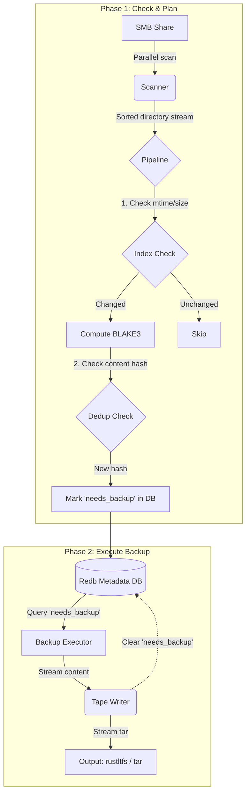

# Rumba - Rust LTFS Git-like Backup Tool

High-performance incremental backup tool for LTO tape using Git-inspired content-addressable storage.

[中文文档](README_CN.md)

## Features

- ✅ **Configuration Management**: TOML-based configuration file support
- ✅ **SMB Credential Management**: Username/password authentication for Samba shares
- ✅ **Password Obfuscation**: Base64 encoding for password protection in config files
- ✅ **Incremental Backup**: Content-based deduplication using file hashes
- ✅ **redb Metadata Storage**: Embedded database for backup metadata
- ✅ **Git-like Mechanism**: Content-Addressable Storage (CAS) + Merkle Tree
- ✅ **Streaming Backup**: Zero-temp-file streaming to tape via PowerShell pipes
- 🚧 **LTFS Integration**: Integration with rustltfs for real tape writing

## Quick Start

### 1. Configuration

Copy the example configuration and edit:

```bash
copy config.example.toml config.toml
```

Edit `config.toml` with your settings:

```toml
[source]
url = "\\\\server\\share\\path"
username = "your_username"
password = "your_password"  # or use base64 encoding

[target]
output_mode = "tar"
tape_path = "backup.tar"
db_path = "backup_meta.redb"

[tape]
device = "\\\\.\\TAPE0"  # Windows: \\.\TAPE0, Linux: /dev/sg0
rumba_path = "rumba"
rustltfs_path = "rustltfs"
database_path = "rumba.db"
```

### 2. Password Encoding (Optional)

To avoid storing passwords in plain text:

```bash
cargo run --bin rumba -- encode-password "your_password"
```

Copy the `base64:xxx` output to the `password` field in config.

### 3. Run Backup
Rumba uses a two-stage backup process for maximum efficiency:

#### Step 1: Check & Plan (Required)
Scans the source directory, computes hashes (in parallel), updates the database, and identifies new/modified files.

```bash
# This will scan files and output the number of files needing backup
rumba backup --config config.toml --check
```

#### Step 2: Execute Backup
Reads the backup plan from the database and streams the data to tape. This step is instant (no re-scanning).

```powershell
# Streaming to tape via rustltfs
.\scripts\backup-incremental.ps1 -ConfigFile config.toml
```

Or manually:
```bash
rumba backup --config config.toml --output - | rustltfs write ...
```

### 4. Inspect Database

Use the `db-inspect` tool to view backup metadata:

```bash
# Show statistics
cargo run --bin db-inspect -- stats

# List all blobs
cargo run --bin db-inspect -- list-blobs

# List index entries
cargo run --bin db-inspect -- list-index
```

## Architecture

### Core Design Principles

Rumba borrows from Git's internal mechanisms, designed for massive file backups:

1. **Content-Addressable Storage (CAS)**:
   - Files are stored by content hash (BLAKE3), not filename
   - **Automatic deduplication**: Identical content stored only once
   - **Data integrity**: Hash serves as checksum, preventing silent corruption

2. **Efficient Incremental Backup**:
   - **Level 1 - Quick Check**: Compare file `mtime` and `size` (like Git Index)
   - **Level 2 - Content Check**: If metadata changed, compute content hash and check `blobs` table
   - **Level 3 - Data Write**: Only new content blocks are written to tape

3. **Metadata Separation**:
   - File content streamed to tape (linear storage, optimal for LTO)
   - File metadata (names, permissions, directory structure) in fast local KV database (redb)

### System Architecture



## Common Commands Reference

Assuming `rumba.exe` and `db-inspect.exe` are in your PATH:

### Rumba
- **Check/Scan (Plan)**: 
  ```bash
  rumba backup --check
  ```
- **Backup to Tape (Stream)**: 
  ```powershell
  rumba backup --output - | rustltfs write --tape \\.\TAPE0 ...
  ```
- **Backup to File**: 
  ```bash
  rumba backup --output backup.tar
  ```
- **Encode Password**: 
  ```bash
  rumba encode-password "mypassword"
  ```

### DB Inspect
- **Show Database Stats**: 
  ```bash
  db-inspect stats
  ```
- **List All Indexed Files**: 
  ```bash
  db-inspect list-index
  ```
- **Show Specific File Info**: 
  ```bash
  db-inspect show-index "\\server\share\file.txt"
  ```
- **List Deduplicated Blobs**: 
  ```bash
  db-inspect list-blobs
  ```

## Streaming Backup

Rumba supports **zero-temp-file streaming** for optimal performance:

```powershell
# Rumba generates tar → PowerShell pipe → rustltfs writes to tape
rumba backup --config config.toml --output - | `
    rustltfs write --device \\.\TAPE0 --destination /incremental_20251125/backup.tar
```

**Benefits**:
- ✅ Zero temporary files
- ✅ Reduced disk I/O by 66%
- ✅ Real-time streaming
- ✅ Memory-efficient

See [scripts/README.md](scripts/README.md) for detailed usage.

## Project Structure

```
Rumba/
├── src/
│   ├── main.rs          # Main entry point
│   ├── lib.rs           # Library interface
│   ├── config.rs        # Configuration management
│   ├── models.rs        # Data structure definitions
│   ├── db.rs            # redb database operations
│   ├── scanner.rs       # File scanner
│   ├── pipeline.rs      # Backup pipeline
│   ├── diff.rs          # Diff engine
│   ├── tape.rs          # Tape writer
│   └── bin/
│       └── db_inspect.rs # Database inspection tool
├── scripts/
│   ├── backup-incremental.ps1  # Streaming incremental backup script
│   └── restore-from-tape.ps1 # Restore script
├── config.example.toml   # Configuration example
└── Cargo.toml
```

## Configuration

### [source] - Backup Source

- `url`: SMB share path (Windows UNC format)
- `username`: SMB username
- `password`: SMB password (plain text or base64 encoded)
- `excludes`: Glob patterns to exclude from backup

### [target] - Backup Target

- `output_mode`: "rustltfs" or "tar"
- `tape_path`: Tape device path or tar file path
- `db_path`: Metadata database path

### [backup] - Backup Behavior

- `parallel_threads`: Number of parallel scanning threads (default: CPU cores)
- `compression_level`: Zstd compression level 0-22 (default: 3)

### [tape] - Tape Device Configuration

- `device`: Tape device path (Windows: `\\\\.\\TAPE0`, Linux: `/dev/sg0`)
- `rumba_path`: Path to rumba executable
- `rustltfs_path`: Path to rustltfs executable
- `database_path`: Database file path
- `skip_database`: Skip database backup
- `email_notification`: Enable email notifications
- `email_to`: Email recipient
- `smtp_server`: SMTP server address

## Security Notes

⚠️ **Password Storage**:

- Base64 encoding provides **obfuscation**, not encryption
- Not recommended for production use
- Consider using:
  - Windows Credential Manager API
  - Runtime password prompts
  - Environment variables

## Technology Stack

- **Language**: Rust 2021 Edition
- **Database**: redb (embedded KV store)
- **Serialization**: rkyv (zero-copy)
- **Hashing**: BLAKE3 (SIMD-accelerated)
- **Scanning**: jwalk (parallel traversal)
- **Configuration**: TOML + serde
- **CLI**: clap

## License

[MIT](LICENSE)
