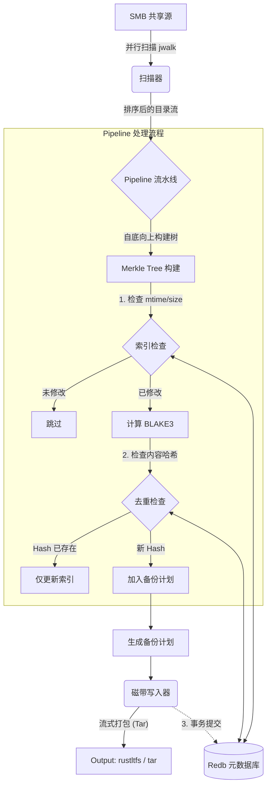

# Rumba - Rust LTFS Git-like Backup Tool

高性能的 LTO 磁带增量备份工具，使用 Git 理念进行内容寻址存储。

## 功能特性

- ✅ **配置文件管理**: 支持 TOML 格式的配置文件
- ✅ **SMB 凭证管理**: 支持 Samba 共享的用户名/密码认证
- ✅ **密码模糊化**: 使用 Base64 编码保护配置文件中的密码
- ✅ **增量备份**: 基于文件内容 Hash 的去重和索引
- ✅ **redb 元数据存储**: 使用嵌入式数据库存储备份元数据
- ✅ **Git-like 机制**: 内容寻址存储 (CAS) + Merkle Tree
- 🚧 **LTFS 集成**: 计划集成 rustltfs 进行真实磁带写入

## 架构与原理

### 核心设计理念

Rumba 借鉴了 Git 的内部机制，专为海量文件备份设计：

1.  **内容寻址存储 (CAS)**:
    - 文件不按文件名存储，而是按内容的 BLAKE3 哈希存储。
    - **自动去重**: 相同内容的文件（即使文件名不同）只存储一份数据。
    - **数据完整性**: 哈希值即校验和，天然防止静默数据损坏。

2.  **高效增量备份**:
    - **Level 1 - 快速检查**: 对比文件 `mtime` 和 `size`（类似 Git Index）。如果未变，直接跳过。
    - **Level 2 - 内容检查**: 如果元数据变化，计算内容哈希。查询数据库 `blobs` 表，如果哈希已存在，仅更新索引（无需重传数据）。
    - **Level 3 - 数据写入**: 只有全新的内容块才会被写入磁带。

3.  **元数据分离**:
    - 文件内容流式写入磁带（线性存储，适合 LTO）。
    - 文件元数据（文件名、权限、目录结构）存储在快速的本地 KV 数据库 (redb) 中。

### 系统架构图

```mermaid
graph TD
    subgraph Phase 1: 检查与计划 (Check & Plan)
        Source[SMB 共享源] -->|并行扫描| Scanner(扫描器)
        Scanner -->|排序后的目录流| Pipeline{Pipeline}
        Pipeline -->|1. 检查 mtime/size| IndexCheck{索引检查}
        IndexCheck -->|已修改| Hasher[计算 BLAKE3]
        Hasher -->|2. 检查内容哈希| DedupCheck{去重检查}
        DedupCheck -->|新 Hash| MarkDB[在 DB 中标记 'needs_backup']
        IndexCheck -->|未修改| Skip[跳过]
    end

    subgraph Phase 2: 执行备份 (Execute Backup)
        DB[(Redb 元数据库)] -->|查询 'needs_backup'| BackupExec[备份执行器]
        BackupExec -->|读取内容| TapeWriter(磁带写入器)
        TapeWriter -->|流式打包| Output[Output: rustltfs / tar]
        TapeWriter -.->|清除 'needs_backup'| DB
    end
    
    MarkDB --> DB
```

## 常用命令速查

假设 `rumba.exe` 和 `db-inspect.exe` 已在您的 PATH 中：

### Rumba
- **检查/扫描 (Plan)**: 
  ```bash
  rumba backup --check
  ```
- **备份到磁带 (流式)**: 
  ```powershell
  rumba backup --output - | rustltfs write --tape \\.\TAPE0 ...
  ```
- **备份到文件**: 
  ```bash
  rumba backup --output backup.tar
  ```
- **编码密码**: 
  ```bash
  rumba encode-password "mypassword"
  ```

### DB Inspect (数据库检查)
- **显示数据库统计**: 
  ```bash
  db-inspect stats
  ```
- **列出所有索引文件**: 
  ```bash
  db-inspect list-index
  ```
- **查看特定文件信息**: 
  ```bash
  db-inspect show-index "\\server\share\file.txt"
  ```
- **列出去重 Blobs**: 
  ```bash
  db-inspect list-blobs
  ```

### 核心模块与函数调用说明

#### 1. Scanner (`src/scanner.rs`)
负责文件系统的遍历。
- **`scan_parallel`**: 使用 `jwalk` 进行多线程递归扫描。
  - **关键特性**: 为了保证 Merkle Tree 计算的确定性，在处理每个目录时，会对子项按文件名进行**严格排序** (`children.sort_by`)。
  - **输出**: 通过 Channel 发送 `ScannedDir` 结构，包含排序后的目录条目。

#### 2. Pipeline (`src/pipeline.rs`)
备份流程的编排者，采用**自底向上 (Bottom-Up)** 策略。
- **`run`**: 启动扫描线程，接收扫描结果。
  - **排序**: 将所有路径按长度降序排序（先处理叶子节点/子目录，再处理父目录）。
  - **Tree 构建**: 逐层计算目录的 Merkle Hash。子目录的 Hash 会被父目录引用。
  - **文件处理**: 对每个文件调用 Diff 引擎。

#### 3. Diff Engine (`src/diff.rs`)
负责判断文件是否需要备份。
- **`check_index(path, mtime, size)`**: 查询 `index` 表。如果 mtime 和 size 匹配，返回 `Some(Hash)`（跳过哈希计算）。
- **`should_backup_blob(hash)`**: 查询 `blobs` 表。如果 Hash 已存在，返回 `false`（跳过数据传输，仅更新引用）。

#### 4. Tape Writer (`src/tape.rs`)
负责将文件打包并写入目标。
- **`write_plan`**: 接收 `BackupPlan`，遍历新增文件列表。
- **Tar 打包**: 使用 `tar::Builder` 生成标准 Tar 流。
  - **文件名格式**: `original_filename_hash` (例如 `report.pdf_a1b2c3...`)，确保文件名唯一且包含内容指纹。
- **输出模式**:
  - **`RustLtfs`**: 启动 `rustltfs` 子进程，通过 Stdin 管道传输数据（生产模式）。
  - **`TarFile`**: 写入本地文件，文件名包含时间戳（测试模式）。

#### 5. Database (`src/db.rs`)
封装 `redb` 操作，使用 `rkyv` 进行零拷贝序列化。
- **表结构**:
  - `blobs`: `Hash -> (TapeID, Offset)` (去重索引)
  - `index`: `Path -> (Mtime, Size, Hash)` (快速增量索引)
  - `trees`: `Hash -> Vec<TreeEntry>` (目录结构，待完善)
- **对齐处理**: 在读取数据时使用 `to_vec()` 将数据复制到对齐的内存缓冲区，解决 `rkyv` 的对齐要求。

#### 6. Data Models (`src/models.rs`)
定义核心数据结构，均支持 `rkyv` 零拷贝序列化。
- **`FileMetadata`**: 文件的元数据（大小、mtime、权限等）。
- **`TreeEntry`**: 目录树中的节点，包含文件名、模式和 Hash 指针。
- **`BlobLocation`**: 记录 Blob 在磁带上的物理位置（TapeID + Offset）。


## 架构与原理

### 核心设计理念

Rumba 借鉴了 Git 的内部机制，专为海量文件备份设计：

1.  **内容寻址存储 (CAS)**:
    - 文件不按文件名存储，而是按内容的 BLAKE3 哈希存储。
    - **自动去重**: 相同内容的文件（即使文件名不同）只存储一份数据。
    - **数据完整性**: 哈希值即校验和，天然防止静默数据损坏。

2.  **高效增量备份**:
    - **Level 1 - 快速检查**: 对比文件 `mtime` 和 `size`（类似 Git Index）。如果未变，直接跳过。
    - **Level 2 - 内容检查**: 如果元数据变化，计算内容哈希。查询数据库 `blobs` 表，如果哈希已存在，仅更新索引（无需重传数据）。
    - **Level 3 - 数据写入**: 只有全新的内容块才会被写入磁带。

3.  **元数据分离**:
    - 文件内容流式写入磁带（线性存储，适合 LTO）。
    - 文件元数据（文件名、权限、目录结构）存储在快速的本地 KV 数据库 (redb) 中。

### 系统架构图



### 核心模块与函数调用说明

#### 1. Scanner (`src/scanner.rs`)
负责文件系统的遍历。
- **`scan_parallel`**: 使用 `jwalk` 进行多线程递归扫描。
  - **关键特性**: 为了保证 Merkle Tree 计算的确定性，在处理每个目录时，会对子项按文件名进行**严格排序** (`children.sort_by`)。
  - **输出**: 通过 Channel 发送 `ScannedDir` 结构，包含排序后的目录条目。

#### 2. Pipeline (`src/pipeline.rs`)
备份流程的编排者，采用**自底向上 (Bottom-Up)** 策略。
- **`run`**: 启动扫描线程，接收扫描结果。
  - **排序**: 将所有路径按长度降序排序（先处理叶子节点/子目录，再处理父目录）。
  - **Tree 构建**: 逐层计算目录的 Merkle Hash。子目录的 Hash 会被父目录引用。
  - **文件处理**: 对每个文件调用 Diff 引擎。

#### 3. Diff Engine (`src/diff.rs`)
负责判断文件是否需要备份。
- **`check_index(path, mtime, size)`**: 查询 `index` 表。如果 mtime 和 size 匹配，返回 `Some(Hash)`（跳过哈希计算）。
- **`should_backup_blob(hash)`**: 查询 `blobs` 表。如果 Hash 已存在，返回 `false`（跳过数据传输，仅更新引用）。

#### 4. Tape Writer (`src/tape.rs`)
负责将文件打包并写入目标。
- **`write_plan`**: 接收 `BackupPlan`，遍历新增文件列表。
- **Tar 打包**: 使用 `tar::Builder` 生成标准 Tar 流。
  - **文件名格式**: `original_filename_hash` (例如 `report.pdf_a1b2c3...`)，确保文件名唯一且包含内容指纹。
- **输出模式**:
  - **`RustLtfs`**: 启动 `rustltfs` 子进程，通过 Stdin 管道传输数据（生产模式）。
  - **`TarFile`**: 写入本地文件，文件名包含时间戳（测试模式）。

#### 5. Database (`src/db.rs`)
封装 `redb` 操作，使用 `rkyv` 进行零拷贝序列化。
- **表结构**:
  - `blobs`: `Hash -> (TapeID, Offset)` (去重索引)
  - `index`: `Path -> (Mtime, Size, Hash)` (快速增量索引)
  - `trees`: `Hash -> Vec<TreeEntry>` (目录结构，待完善)
- **对齐处理**: 在读取数据时使用 `to_vec()` 将数据复制到对齐的内存缓冲区，解决 `rkyv` 的对齐要求。


## 快速开始

### 1. 配置文件设置

复制示例配置文件并编辑：

```bash
copy config.example.toml config.toml
```

编辑 `config.toml` 填入你的 SMB 凭证：

```toml
[source]
url = "\\\\server\\share\\path"
username = "your_username"
password = "your_password"  # 或使用 base64 编码

[target]
tape_path = "tape_drive.tar"
db_path = "backup_meta.redb"

[backup]
parallel_threads = 4
compression_level = 3
```

### 2. 密码编码（可选）

为了避免明文存储密码，可以使用 Base64 编码：

```bash
cargo run --bin rumba -- encode-password "your_password"
```

将输出的 `base64:xxx` 粘贴到配置文件的 `password` 字段。

### 3. 运行备份
Rumba 采用两阶段备份流程以实现最高效率：

#### 步骤 1: 检查与计划 (Check & Plan)
扫描源目录，并行计算哈希，更新数据库，并识别新增/修改的文件。

```bash
# 此命令将扫描文件并输出需要备份的文件数量
rumba backup --config config.toml --check
```

#### 步骤 2: 执行备份 (Execute Backup)
从数据库读取备份计划并将数据流式传输到磁带。此步骤是即时的（无需重新扫描）。

```powershell
# 通过 rustltfs 流式传输到磁带
.\scripts\backup-incremental.ps1 -ConfigFile config.toml
```

或者手动执行：
```bash
rumba backup --config config.toml --output - | rustltfs write ...
```

### 4. 检查数据库内容

使用 `db-inspect` 工具查看备份元数据：

```bash
# 显示统计信息
cargo run --bin db-inspect -- stats

# 列出所有 blobs
cargo run --bin db-inspect -- list-blobs

# 列出索引条目
cargo run --bin db-inspect -- list-index

# 查看特定文件的索引
cargo run --bin db-inspect -- show-index "\\\\server\\share\\file.txt"
```

## 测试

### 自动化测试

运行提供的测试脚本：

```bash
.\test_config.bat
```

该脚本会：
1. 清理旧的测试数据
2. 测试密码编码
3. 运行首次备份（所有文件应为新文件）
4. 验证数据库和磁带文件已创建
5. 运行第二次备份（应跳过所有未修改文件）
6. 显示数据库统计信息

### 手动测试

测试三个核心功能（按照提供的测试计划）：

#### 测试 1: SMB 文件差异识别

```bash
cargo run --bin rumba -- --config config_test.toml
```

验证点：
- 程序成功连接到 SMB 共享
- 扫描器遍历所有文件
- 日志显示扫描的文件数量

#### 测试 2: redb 数据库存储

```bash
# 首次备份
cargo run --bin rumba -- --config config_test.toml

# 第二次备份（应显示 "Nothing to backup"）
cargo run --bin rumba -- --config config_test.toml

# 检查数据库
cargo run --bin db-inspect -- stats
```

#### 测试 3: 文件流输出（Mock rustltfs）

```bash
# 运行备份
cargo run --bin rumba -- --config config_test.toml

# 检查生成的 tar 文件
tar -tvf tape_drive.tar
```

当前实现将文件流写入本地 `tape_drive.tar` 文件。未来可以通过管道传递给 `rustltfs` 进程。

## 项目结构

```
Rumba/
├── src/
│   ├── main.rs          # 主程序入口
│   ├── lib.rs           # 库接口
│   ├── config.rs        # 配置文件管理 ⭐ NEW
│   ├── models.rs        # 数据结构定义
│   ├── db.rs            # redb 数据库操作
│   ├── scanner.rs       # 文件扫描器
│   ├── pipeline.rs      # 备份流水线
│   ├── diff.rs          # 差异计算引擎
│   ├── tape.rs          # 磁带写入器
│   └── bin/
│       └── db_inspect.rs # 数据库检查工具 ⭐ NEW
├── config.example.toml   # 配置文件示例 ⭐ NEW
├── config_test.toml      # 测试配置 ⭐ NEW
└── Cargo.toml
```

## 配置说明

### [source] - 备份源配置

- `url`: SMB 共享路径（Windows UNC 格式）
- `username`: SMB 用户名
- `password`: SMB 密码（支持明文或 base64 编码）

### [target] - 备份目标配置

- `tape_path`: 磁带设备路径或模拟文件路径
- `db_path`: 元数据数据库路径

### [backup] - 备份行为配置

- `parallel_threads`: 并行扫描线程数（默认：CPU 核心数）
- `compression_level`: Zstd 压缩级别 0-22（默认：3）

## 安全注意事项

⚠️ **密码存储**：

- Base64 编码仅提供**模糊化**，不是加密
- 不建议在生产环境中将密码存储在配置文件中
- 考虑使用：
  - Windows 凭证管理器 API
  - 运行时密码提示
  - 环境变量传递

## 技术栈

- **语言**: Rust 2021 Edition
- **数据库**: redb (嵌入式 KV 存储)
- **序列化**: rkyv (零拷贝)
- **哈希**: BLAKE3 (SIMD 加速)
- **扫描**: jwalk (并行遍历)
- **配置**: TOML + serde
- **CLI**: clap

## 许可证

[MIT](LICENSE)
